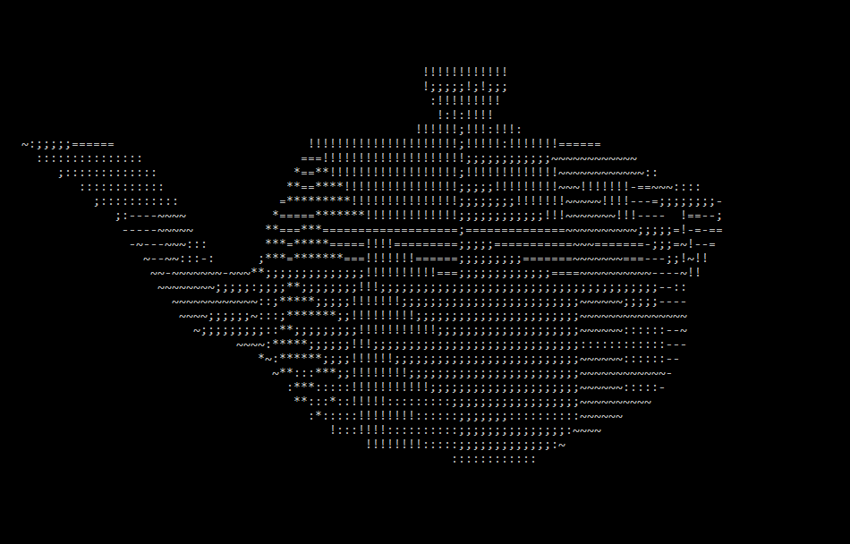
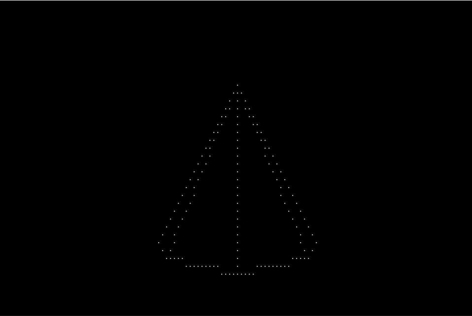
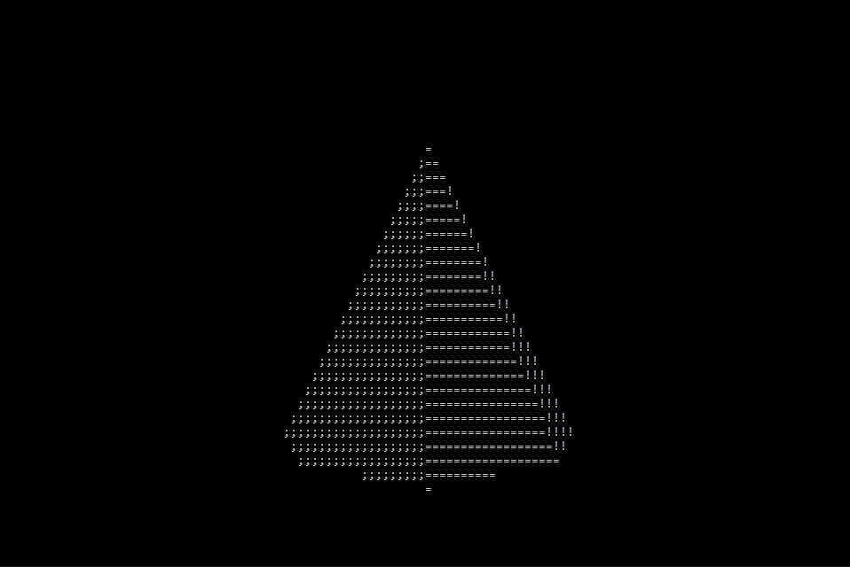

# a simple renderer for windows terminal 

## controls:

* W A S D Q E for moving object
* Z X and arrows for rotating
* C V for scaling
* R for changing render type

to open an .obj file you can drag and drop it on .exe file or run the program from a terminal with a path to the model as
a comand line argument.

## some issues:

* .obj file should contain only vertex and face data, all faces should be triangles.
* problems with loading some models, if they are not rotated (solving - rotate a model a little bit in a 3d editor)
* switching render type

## helpfull links:

* [Cdonut](https://www.a1k0n.net/2011/07/20/donut-math.html)
* [video about cdonut](https://www.youtube.com/watch?v=DEqXNfs_HhY&ab_channel=LexFridman)
* [Computer Graphics from scratch](https://www.gabrielgambetta.com/computer-graphics-from-scratch/rasterization.html)
* [компьютерная графика с нуля](https://habr.com/ru/post/342708/)
* [very helpfull video](https://www.youtube.com/watch?v=XgMWc6LumG4&ab_channel=javidx9)
